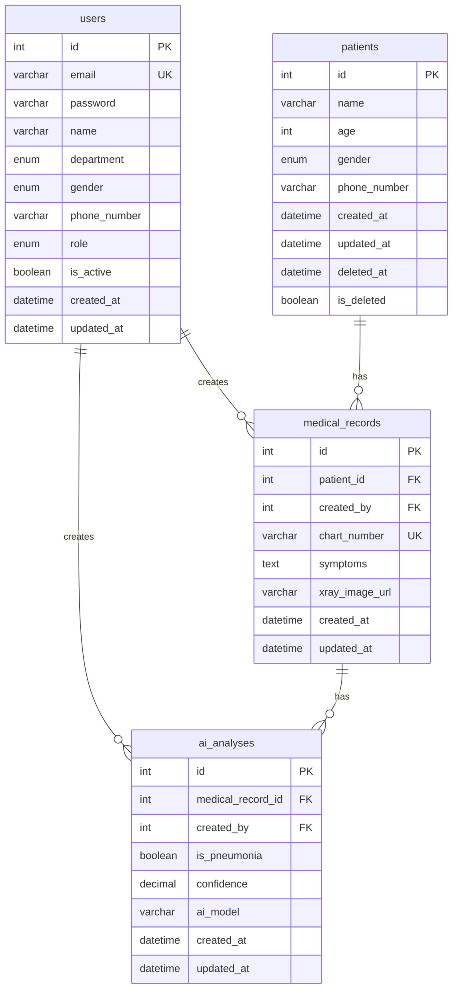

# 3일차 DB 모델 및 마이그레이션

## 선택한 데이터베이스

템플릿의 `docker-compose.yml`, `app/core/config.py`, `app/core/db/databases.py`가 이미 MySQL 8.0과 `mysql+asyncmy`를 기준으로 작성되어 있으므로 이번 과제도 MySQL을 사용한다.

## 작성한 ORM 모델

- `app/models/user.py`: 사용자 계정, 부서, 성별, 권한, 활성 상태
- `app/models/patient.py`: 환자 기본 정보, soft delete 컬럼
- `app/models/medical_record.py`: 환자별 진료 기록, 차트 번호, 증상, X-Ray 이미지 URL
- `app/models/ai_analysis.py`: 진료 기록별 AI 폐렴 예측 결과

## ERD 정리



## 마이그레이션 파일

추가한 파일:

```text
alembic/versions/20260715_01_create_health_domain_tables.py
```

생성되는 테이블:

- `users`
- `patients`
- `medical_records`
- `ai_analyses`

주요 관계:

- `patients.id` -> `medical_records.patient_id`
- `users.id` -> `medical_records.created_by`
- `medical_records.id` -> `ai_analyses.medical_record_id`
- `users.id` -> `ai_analyses.created_by`

## 로컬 적용 방법

```bash
cp .env.example .env
docker compose up -d mysql
uv run alembic upgrade head
uv run alembic current
```

DB Viewer에서 확인할 항목:

- `users`, `patients`, `medical_records`, `ai_analyses` 테이블이 생성되었는지 확인
- `medical_records.patient_id`가 `patients.id`를 참조하는지 확인
- `ai_analyses.medical_record_id`가 `medical_records.id`를 참조하는지 확인
- `users.email`, `medical_records.chart_number`에 unique index가 생성되었는지 확인

## 적용 후 예상 스키마 확인 SQL

```sql
SHOW TABLES;
DESCRIBE users;
DESCRIBE patients;
DESCRIBE medical_records;
DESCRIBE ai_analyses;
SHOW INDEX FROM users;
SHOW INDEX FROM medical_records;
```

## 작업 메모

모델의 Enum 컬럼은 프론트엔드가 사용하는 문자열과 맞추기 위해 `pending`, `staff`, `admin`, `male`, `female`, `developer`, `medical team`, `researcher` 값을 그대로 저장하도록 작성했다.
