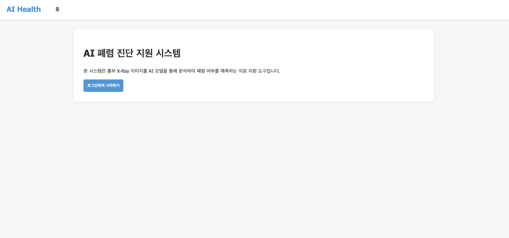
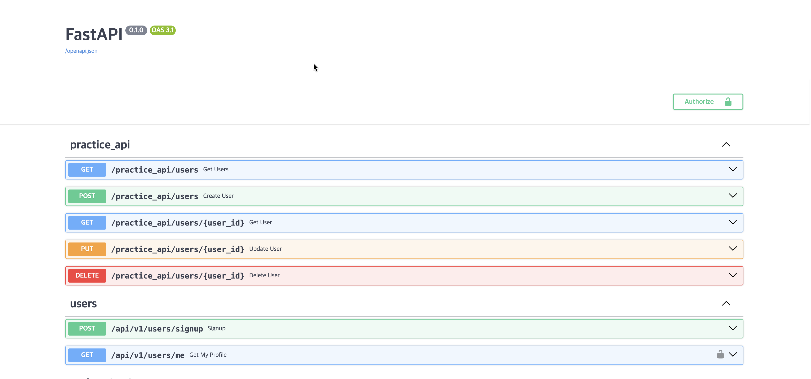
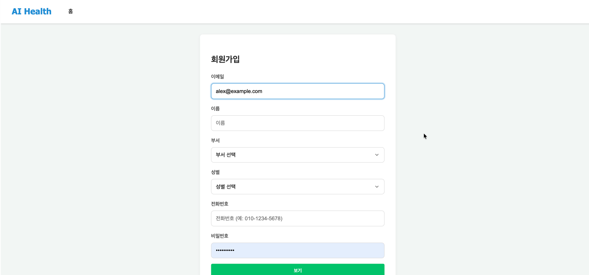
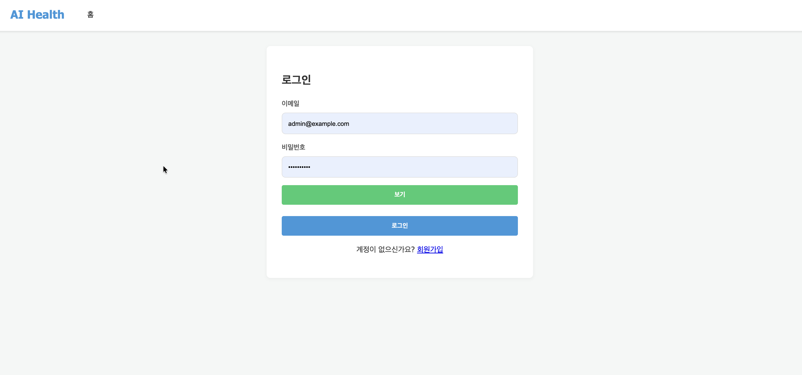
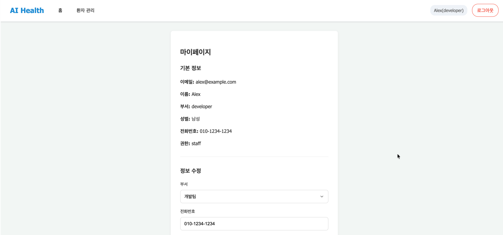
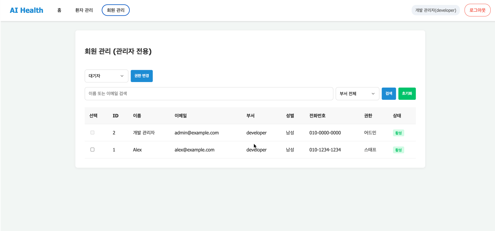
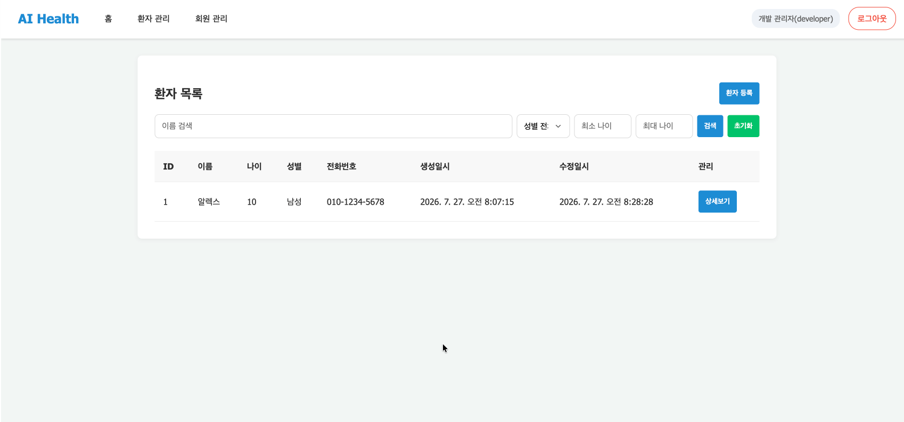
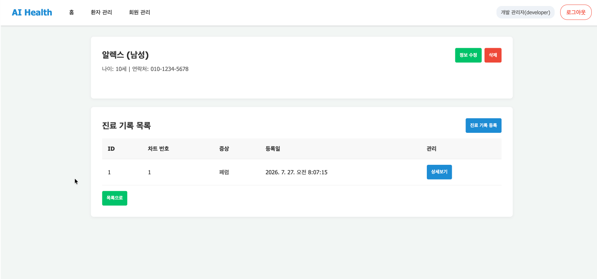
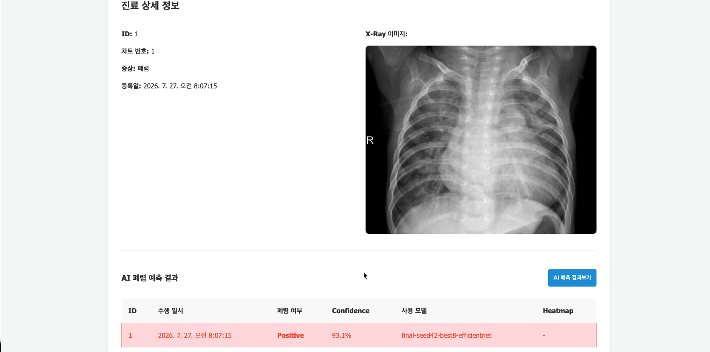

# 7일차 FastAPI 실행 화면

## 1. 실행 및 확인 환경

- FastAPI 실행 주소: `http://0.0.0.0:8000`
- 프론트엔드 접속 주소: `http://localhost:8000`
- API 문서: `http://localhost:8000/docs`
- 데이터베이스: MySQL
- 인증 방식: JWT Access Token 및 HTTP-only Refresh Token Cookie
- 테스트 계정
  - 관리자: `admin@example.com`
  - 스태프: `alex@example.com`

FastAPI 앱을 실행한 후 제공된 `./static` 프론트엔드 템플릿에서 회원, 환자,
진료기록 및 AI 폐렴 예측 API가 정상적으로 연결되는지 확인하였다.

## 2. 메인 화면

- URL: `/`
- 비로그인 상태에서는 서비스 소개와 로그인 화면으로 이동하는 버튼을 표시한다.
- 로그인 상태에서는 사용자의 권한에 맞는 환자 관리, 회원 관리 등의 메뉴를 표시한다.

## 3. FastAPI Swagger 엔드포인트

`/docs`에서 FastAPI에 등록된 엔드포인트와 요청 및 응답 스키마를 확인하였다.
JWT 인증이 필요한 API에는 자물쇠 아이콘이 표시되며, `Authorize` 버튼을 통해
Access Token을 입력하여 API를 직접 테스트할 수 있다.

## 4. 회원 API

### 4.1 회원가입

| 항목 | 내용 |
| --- | --- |
| Endpoint | `POST /api/v1/users/signup` |
| 프론트엔드 URL | `/signup` |
| 동작 | 이메일, 이름, 부서, 성별, 전화번호 및 비밀번호를 입력하여 회원가입을 요청한다. |
| 처리 결과 | 가입이 완료되면 로그인 화면으로 이동하며 신규 사용자는 대기자 권한으로 생성된다. |

프론트엔드는 전화번호에서 숫자 이외의 문자를 제거하여 전송하며, 백엔드는
하이픈이 포함된 번호와 포함되지 않은 번호를 모두 검증할 수 있다. 비밀번호
입력란은 기본적으로 마스킹되고 `보기` 버튼으로 입력값 표시 여부를 전환한다.

### 4.2 로그인, 토큰 재발급 및 로그아웃

| 기능 | Endpoint | 프론트엔드 동작 |
| --- | --- | --- |
| 로그인 | `POST /api/v1/users/login` | 이메일과 비밀번호를 Form Data로 전송한다. 성공하면 Access Token을 저장하고 환자 목록으로 이동한다. |
| 토큰 재발급 | `POST /api/v1/users/refresh` | API 요청이 `401`을 반환하면 HTTP-only Cookie의 Refresh Token으로 Access Token을 재발급하고 기존 요청을 재시도한다. |
| 로그아웃 | `POST /api/v1/users/logout` | 상단의 로그아웃 버튼을 누르면 Refresh Token Cookie를 삭제하고 로그인 화면으로 이동한다. |

관리자 로그인 후 환자 관리 및 회원 관리 메뉴가 노출되는 것을 통해 인증과
권한별 화면 구성이 정상적으로 적용됨을 확인하였다.

### 4.3 마이페이지 조회 및 회원정보 수정

| 기능 | Endpoint | 프론트엔드 동작 |
| --- | --- | --- |
| 마이페이지 조회 | `GET /api/v1/users/me` | 로그인 사용자의 이메일, 이름, 부서, 성별, 전화번호 및 권한을 화면에 표시한다. |
| 회원정보 수정 | `PATCH /api/v1/users/me` | 부서와 전화번호 중 변경한 항목만 부분 수정한다. |
| 비밀번호 변경 | `PATCH /api/v1/users/me/password` | 기존 비밀번호를 확인한 뒤 새 비밀번호를 적용한다. |
| 회원탈퇴 | `DELETE /api/v1/users/me` | 확인 절차 후 로그인 사용자의 계정과 관련 데이터를 삭제하고 로그인 화면으로 이동한다. |

화면에서 스태프 계정 `Alex`의 가입 정보와 현재 권한을 조회하고, 부서 및
전화번호 수정 입력란이 정상적으로 출력되는 것을 확인하였다.

### 4.4 관리자 회원 목록 및 권한 변경

| 기능 | Endpoint | 프론트엔드 동작 |
| --- | --- | --- |
| 회원 목록 조회 | `GET /api/v1/admin/users` | 이름 또는 이메일 검색, 부서 필터를 적용하여 회원 목록을 조회한다. |
| 회원 권한 변경 | `PATCH /api/v1/admin/users/role` | 선택한 회원들의 권한을 대기자, 스태프 또는 어드민으로 일괄 변경한다. |

관리자 계정으로 접속했을 때만 회원 관리 메뉴가 표시된다. 목록에서 회원의
ID, 이름, 이메일, 부서, 성별, 전화번호, 권한 및 활성 상태를 확인할 수 있으며,
자기 자신의 권한 변경 체크박스는 비활성화된다.

## 5. 환자 API

### 5.1 환자 등록 및 목록 조회

| 기능 | Endpoint | 프론트엔드 동작 |
| --- | --- | --- |
| 환자 등록 | `POST /api/v1/patients` | 권한이 있는 사용자가 이름, 나이, 성별 및 전화번호를 입력하여 환자를 등록한다. |
| 환자 목록 조회 | `GET /api/v1/patients` | 이름 검색, 성별, 최소 나이 및 최대 나이 조건으로 환자 목록을 조회한다. |

환자 목록에서 ID, 이름, 나이, 성별, 전화번호, 생성일시 및 수정일시가
표시되는 것을 확인하였다. 각 행의 `상세보기` 버튼을 통해 환자 상세 화면으로
이동한다.

### 5.2 환자 상세 조회, 수정 및 삭제

| 기능 | Endpoint | 프론트엔드 동작 |
| --- | --- | --- |
| 환자 상세 조회 | `GET /api/v1/patients/{patient_id}` | 선택한 환자의 이름, 나이, 성별 및 연락처를 표시한다. |
| 환자 정보 수정 | `PATCH /api/v1/patients/{patient_id}` | 정보 수정 버튼을 통해 이름과 전화번호를 부분 수정한다. |
| 환자 삭제 | `DELETE /api/v1/patients/{patient_id}` | 삭제 확인 후 환자와 관련 진료기록 및 X-ray 데이터를 삭제한다. |

환자 상세 화면에서 환자 정보와 해당 환자의 진료기록 목록이 함께 조회되는
것을 확인하였다.

## 6. 진료기록 API

| 기능 | Endpoint | 프론트엔드 동작 |
| --- | --- | --- |
| 진료기록 등록 | `POST /api/v1/medical-records` | 환자 ID, 차트 번호, 증상 및 X-ray 이미지를 Multipart Form Data로 전송한다. |
| 진료기록 목록 조회 | `GET /api/v1/patients/{patient_id}/medical-records` | 환자 상세 화면에 진료기록 ID, 차트 번호, 증상 요약 및 등록일을 표시한다. |
| 진료기록 상세 조회 | `GET /api/v1/medical-records/{record_id}` | 진료기록 ID, 차트 번호, 전체 증상, 등록일 및 업로드한 X-ray 이미지를 표시한다. |

환자 상세 화면의 `진료 기록 등록` 버튼으로 등록 화면에 이동하며, 목록의
`상세보기` 버튼으로 진료기록 상세 화면에 이동한다. 상세 화면에서 업로드한
흉부 X-ray 이미지가 정상적으로 제공되는 것을 확인하였다.

## 7. AI 폐렴 예측 API

진료기록 상세 화면에서 `AI 예측 결과보기` 버튼을 누르면 저장된 X-ray
이미지를 모델에 입력하여 폐렴 여부를 예측한다.

| 기능 | OpenAPI Endpoint | 프론트엔드 연결 Endpoint | 프론트엔드 동작 |
| --- | --- | --- | --- |
| 폐렴 예측 수행 | `POST /api/v1/medical-records/{record_id}/predictions` | `POST /api/v1/medical-records/{record_id}/predict` | X-ray 이미지를 이용해 예측하며, 같은 진료기록과 모델의 결과가 이미 있으면 저장된 결과를 반환한다. |
| 예측 결과 목록 조회 | `GET /api/v1/medical-records/{record_id}/predictions` | `GET /api/v1/medical-records/{record_id}/analyses` | 진료기록별 AI 예측 결과를 목록으로 불러와 화면에 표시한다. |

현재 프론트엔드 템플릿은 호환용 Endpoint인 `/predict`, `/analyses`를
사용하고 있으며 두 경로 모두 동일한 예측 서비스와 연결되어 있다.

실행 화면에서 다음 결과가 정상적으로 표시되는 것을 확인하였다.

- 예측 결과 ID: `1`
- 폐렴 여부: `Positive`
- Confidence: `93.1%`
- 사용 모델: `final-seed42-best8-efficientnet`
- Heatmap: 선택사항이므로 결과가 없을 때 `-`로 표시

## 8. 엔드포인트별 연결 결과 요약

| 분류 | Method | Endpoint | 프론트엔드 연결 |
| --- | --- | --- | --- |
| 회원가입 | POST | `/api/v1/users/signup` | 완료 |
| 로그인 | POST | `/api/v1/users/login` | 완료 |
| 토큰 재발급 | POST | `/api/v1/users/refresh` | 완료 |
| 로그아웃 | POST | `/api/v1/users/logout` | 완료 |
| 마이페이지 조회 | GET | `/api/v1/users/me` | 완료 |
| 회원정보 수정 | PATCH | `/api/v1/users/me` | 완료 |
| 비밀번호 변경 | PATCH | `/api/v1/users/me/password` | 완료 |
| 회원탈퇴 | DELETE | `/api/v1/users/me` | 완료 |
| 관리자 회원 목록 | GET | `/api/v1/admin/users` | 완료 |
| 회원 권한 변경 | PATCH | `/api/v1/admin/users/role` | 완료 |
| 환자 등록 | POST | `/api/v1/patients` | 완료 |
| 환자 목록 조회 | GET | `/api/v1/patients` | 완료 |
| 환자 상세 조회 | GET | `/api/v1/patients/{patient_id}` | 완료 |
| 환자 정보 수정 | PATCH | `/api/v1/patients/{patient_id}` | 완료 |
| 환자 삭제 | DELETE | `/api/v1/patients/{patient_id}` | 완료 |
| 진료기록 등록 | POST | `/api/v1/medical-records` | 완료 |
| 진료기록 목록 조회 | GET | `/api/v1/patients/{patient_id}/medical-records` | 완료 |
| 진료기록 상세 조회 | GET | `/api/v1/medical-records/{record_id}` | 완료 |
| AI 폐렴 예측 | POST | `/api/v1/medical-records/{record_id}/predictions` | 완료 |
| AI 예측 결과 목록 | GET | `/api/v1/medical-records/{record_id}/predictions` | 완료 |

## 9. 최종 확인

프론트엔드 템플릿에서 JWT 인증, 권한별 메뉴, 회원 관리, 환자 관리,
진료기록 조회, X-ray 이미지 제공 및 AI 폐렴 예측 결과 표시가 정상적으로
동작하는 것을 확인하였다.
