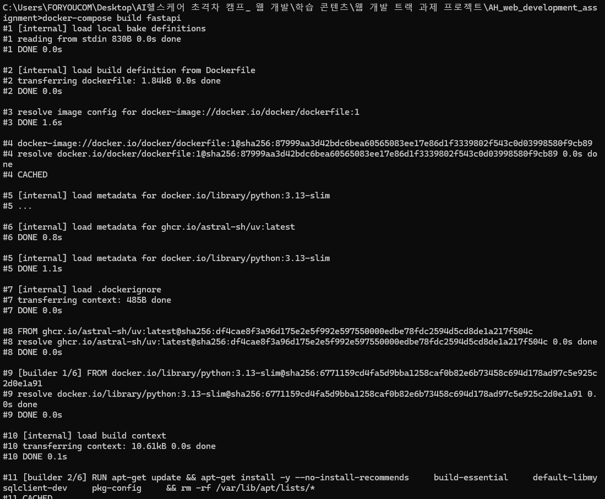
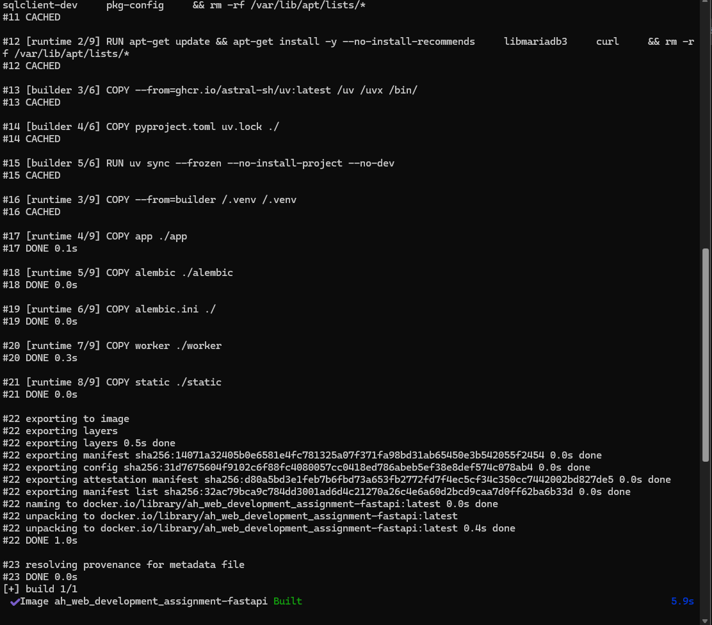
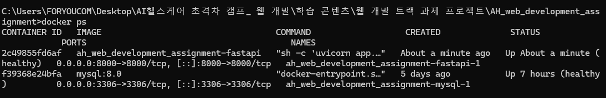
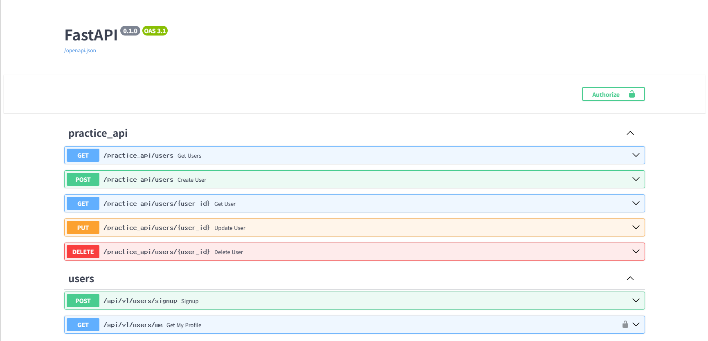
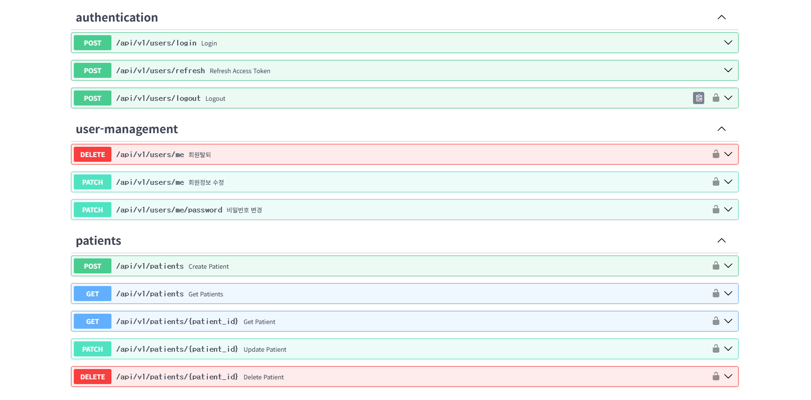
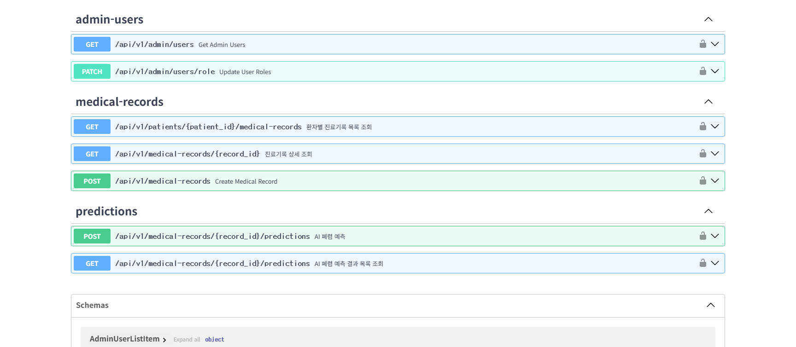

# 8일차 - Docker Dockerfile / docker-compose 실행 화면

## 1. 개요

- `app/Dockerfile`: FastAPI 앱 이미지를 빌드하기 위한 멀티스테이지 Dockerfile 작성
  - builder 스테이지: `asyncmy`, `argon2-cffi` 등 C 확장 빌드에 필요한 패키지(`build-essential`, `default-libmysqlclient-dev`) 설치 후 `uv sync`로 의존성 설치
  - runtime 스테이지: 빌드 도구 없이 가상환경(`/.venv`)과 애플리케이션 코드만 포함하여 이미지 경량화
- `app/.dockerignore`, `.dockerignore`(프로젝트 루트): env 파일, 파이썬/라이브러리 캐시, 도커 관련 설정 파일, docs, README.md, IDE 설정 파일 제외
  - 참고: 빌드 컨텍스트가 프로젝트 루트(`context: .`)이므로 실제로는 루트의 `.dockerignore`가 적용됨. `app/.dockerignore`는 과제 요구 경로 준수를 위해 동일한 내용으로 함께 작성.
- `docker-compose.yml`: `fastapi` 서비스에 `env_file`, `DB_HOST` 환경변수 오버라이드, `mysql` healthcheck 기반 대기(`depends_on: condition: service_healthy`) 추가

## 2. 이미지 빌드

```
docker-compose build fastapi
```

- builder 스테이지에서 `uv sync`로 의존성 설치 후, runtime 스테이지에 가상환경만 복사하는 멀티스테이지 빌드 과정이 정상적으로 진행됨
- torch, timm 등 AI 추론에 필요한 패키지를 포함해 최종적으로 이미지 빌드 완료 (`Image ah_web_development_assignment-fastapi Built`)




## 3. 컨테이너 실행

```
docker-compose up -d
docker ps
```

- `mysql`, `fastapi` 컨테이너 모두 `healthy` 상태로 정상 기동



## 4. API 정상 동작 확인 (Swagger UI)

```
http://localhost:8000/docs
```

컨테이너로 띄운 FastAPI 앱에서 Swagger UI가 정상적으로 열리고, 팀 전체 API 엔드포인트가 정상적으로 노출됨을 확인함.

**practice_api / users**



**authentication / user-management / patients (담당 파트: 회원가입 / 환자 등록·상세조회·수정·삭제)**

`patients` 그룹에 담당한 5개 엔드포인트(등록/목록조회/상세조회/수정/삭제)가 정상적으로 노출되는 것을 확인함.



**admin-users / medical-records / predictions**



## 5. 참고 / 특이사항

- `docker-compose.yml`의 `./app:/app` 볼륨 마운트 구조상, 컨테이너 내부 `/app` 경로가 호스트의 `app/` 폴더로 완전히 대체됨. 따라서 Python 가상환경은 `/app`이 아닌 `/.venv`(프로젝트 루트 바깥)에 설치하도록 Dockerfile을 구성함.
- 현재 `fastapi` 이미지에는 AI 추론용 무거운 패키지(torch, CUDA 관련)까지 포함되어 있어 이미지 용량이 큼. 추후 워커 분리 단계(Docker 3단계)에서 `pyproject.toml`의 app/ai 의존성을 분리하면 경량화 가능.
