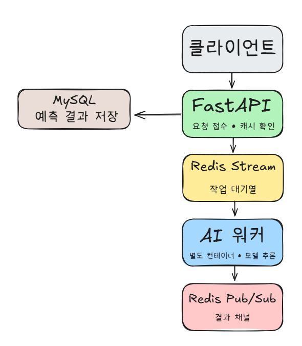

# 9일차 - 동시성 문제 해결을 위한 아키텍처 설계

## 1. 왜 이 문제가 생겼나 (현재 구조의 한계)

현재 폐렴 예측 API(`app/services/prediction_service.py`)는 아래와 같이 동작한다.

```
FastAPI 요청 스레드
  └─ run_in_threadpool(predict_pneumonia, image_path)  # 같은 프로세스 안에서 동기 추론 실행
       └─ AI_INFERENCE_TIMEOUT_SECONDS 안에 안 끝나면 504 반환
```

즉 **AI 모델 추론이 FastAPI 앱과 같은 프로세스, 같은 컨테이너 안에서** 실행된다. 이 구조는 다음 문제를 만든다.

- **동시 요청에 취약함**: FastAPI 워커의 스레드풀이 AI 추론(CPU/GPU 연산, torch)에 점유되면, 그동안 다른 API 요청(회원가입, 로그인 등 가벼운 요청)까지 같이 느려질 수 있다. 무거운 작업과 가벼운 API가 자원을 두고 경쟁한다.
- **스케일이 결합되어 있음**: 트래픽이 몰려서 AI 추론만 더 늘리고 싶어도, FastAPI 컨테이너 자체를 늘려야 한다. AI 워커는 GPU가 필요할 수 있고 FastAPI는 필요 없는데, 이미지 안에 torch/CUDA가 같이 들어가 있어서 이미지도 무겁고 배포 단위도 분리가 안 된다. (실제로 Docker Stage 1-2에서 만든 fastapi 이미지에 torch, CUDA 관련 패키지가 전부 포함되어 이미지 용량이 매우 커진 걸 확인했다.)
- **장애 전파**: 모델 추론 중 예외나 타임아웃이 나면 FastAPI 요청 자체가 영향을 받는다. AI 관련 장애가 API 서버 전체 안정성에 영향을 준다.

## 2. Event-Driven Architecture(EDA)로 푸는 방법

핵심 아이디어는 **"무거운 작업(AI 추론)을 API 서버에서 분리해, 별도의 워커가 비동기로 처리하게 만든다"**는 것이다.

```
FastAPI(생산자, Producer) → 작업 큐에 작업만 등록하고 바로 다음 일을 할 수 있음
AI 워커(소비자, Consumer)  → 큐에서 작업을 꺼내 실제 추론을 수행, 결과를 다시 알려줌
```

이렇게 하면:
- FastAPI는 "큐에 넣기"만 하면 되므로 무거운 연산에 스레드가 묶이지 않는다.
- AI 워커는 FastAPI와 별도 컨테이너/프로세스이므로, 필요하면 워커만 여러 개로 늘릴 수 있다(수평 확장).
- 워커가 죽어도 FastAPI(그리고 사용자 요청 자체)는 죽지 않는다. 재시도나 복구 로직도 워커 쪽에서만 신경 쓰면 된다.

이런 "생산자-소비자" 구조를 메시지 브로커(여기서는 Redis)를 매개로 구현하는 것이 Event-Driven Architecture다.

## 3. Redis를 브로커로 쓰는 이유와, Redis 안에서의 선택지

Redis는 단순 캐시가 아니라 **자료구조 서버**라서, 큐로 쓸 수 있는 방법이 여러 가지 있다. 참고자료를 기반으로 비교하면:

| 방식 | 특징 | 우리 상황에 맞는가 |
| --- | --- | --- |
| Redis List(`LPUSH`/`BRPOP`) | 가장 단순한 큐. 하지만 컨슈머가 메시지를 꺼내가는 순간 큐에서 사라짐 → 처리 도중 워커가 죽으면 그 작업은 유실됨 | 유실 위험이 있어 지양 |
| Redis Pub/Sub | 구독 중인 클라이언트에게만 실시간으로 메시지 전달. 구독자가 없거나 잠깐 끊긴 사이의 메시지는 유실됨(at-most-once) | 결과를 "받는 쪽"에는 적합하지만, 작업을 "쌓아두는 큐"로는 부적합 |
| **Redis Stream + Consumer Group** | 메시지가 로그처럼 순서대로 쌓이고, 컨슈머가 읽어가도 ACK(`XACK`) 하기 전까진 대기 목록(PEL, Pending Entries List)에 남아있음. 여러 워커가 컨슈머 그룹으로 묶이면 각 메시지를 정확히 한 워커에게만 분배(load balancing). 처리 중 워커가 죽어도 `XPENDING`/`XCLAIM`으로 다른 워커가 대신 처리 가능 | ✅ "다중 워커가 안전하게 작업을 나눠 갖고, 비정상 종료 시 복구까지 가능"해야 하는 우리 요구사항에 가장 적합 |

**결론**: **작업 등록(Task Queue)은 Redis Stream + Consumer Group**을 쓴다. 여러 AI 워커가 컨슈머 그룹으로 묶여서 작업을 나눠 갖고, 처리 실패 시 재할당(optional 요구사항)까지 이 구조로 자연스럽게 구현할 수 있다.

**결과 반환(FastAPI가 워커의 처리 결과를 받는 경로)은 Redis Pub/Sub**을 쓴다. FastAPI는 작업을 큐에 넣은 직후, 그 작업 전용 채널(`prediction:result:{task_id}`)을 구독하고 기다린다. 워커가 처리를 끝내면 그 채널에 결과를 발행(publish)하고, FastAPI는 이를 받아 DB에 저장 후 클라이언트에 응답한다. (Pub/Sub은 유실 가능성이 있지만, "이미 큐에 등록된 작업이 처리됐다는 신호"로만 쓰고 타임아웃을 걸어두면, 최악의 경우에도 재시도/폴링으로 복구 가능하다.)

## 4. 동시 요청 중복 방지 (선택 요구사항)

같은 진료기록·같은 모델로 예측을 여러 번(동시에) 요청하는 경우를 대비한다.

- 기존 로직(DB 캐시 확인)을 그대로 유지한다 — 큐에 넣기 전에 먼저 DB에 이미 결과가 있는지 확인하고, 있으면 큐를 거치지 않고 즉시 반환한다.
- 두 요청이 "DB에는 아직 없다"는 걸 동시에 확인하고 동시에 큐에 작업을 두 번 넣는 경쟁 상황(race condition)을 막기 위해, Redis의 `SET key value NX EX <ttl>`(원자적 lock)로 "진행 중" 표시를 하나만 만든다. 두 번째 요청은 락 획득에 실패하면 새 작업을 큐에 넣지 않고, 첫 번째 요청이 만든 것과 같은 결과 채널을 구독해서 같이 기다린다.

## 5. 우리 프로젝트에 적용한 최종 아키텍처

(아래 이미지 - Excalidraw로 그린 다이어그램)



**흐름 요약**
1. 클라이언트가 FastAPI에 예측 요청
2. FastAPI가 DB에서 캐시(동일 진료기록+동일 모델의 기존 결과)를 먼저 확인 → 있으면 즉시 응답, 없으면 다음 단계
3. FastAPI가 Redis Stream(작업 큐)에 작업 등록, 결과 채널(Pub/Sub) 구독 시작
4. AI 워커(별도 컨테이너)가 Stream에서 작업을 꺼내(Consumer Group) 모델 추론 실행
5. 워커가 결과를 Redis Pub/Sub 채널에 발행하고, 처리한 작업을 `XACK`으로 확정
6. FastAPI가 구독 채널에서 결과를 받아 DB에 저장 후 클라이언트에 응답

## 6. 참고자료

- https://oneuptime.com/blog/post/2026-03-31-redis-fastapi-streams-event-processing/view
- https://velog.io/@nickygod/FastAPI-Celery로-AI-Task-비동기-처리하기
- https://python.plainenglish.io/mastering-background-job-queues-with-celery-redis-and-fastapi-9eabb97c38af
- https://chaechae.life/blog/redis-duplication-prevention
- https://dzone.com/articles/distributed-task-queue-python-asyncio-redis
- https://velog.io/@leo4study/Reliable-Queue-정리-with-Redis
